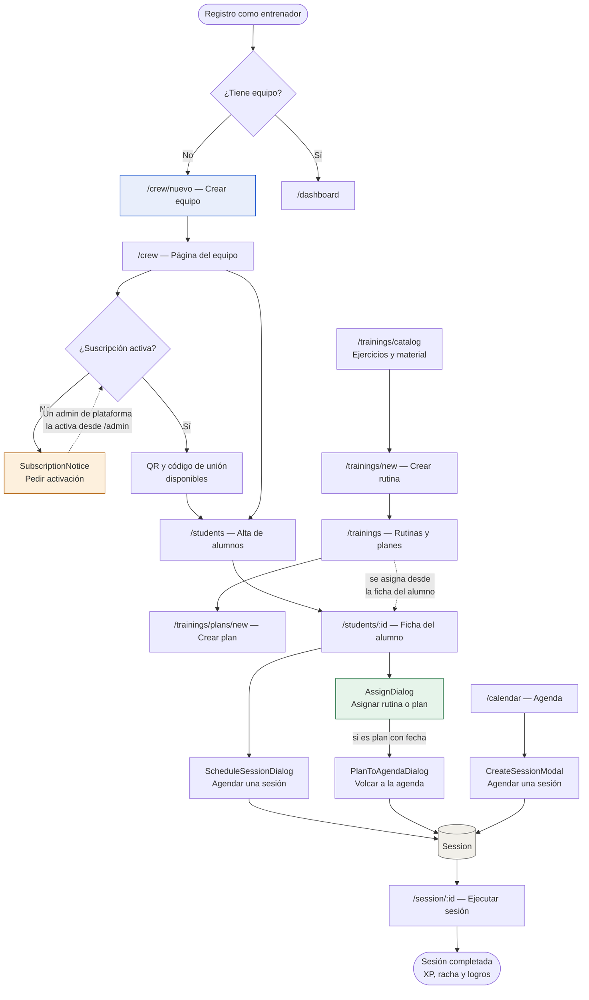
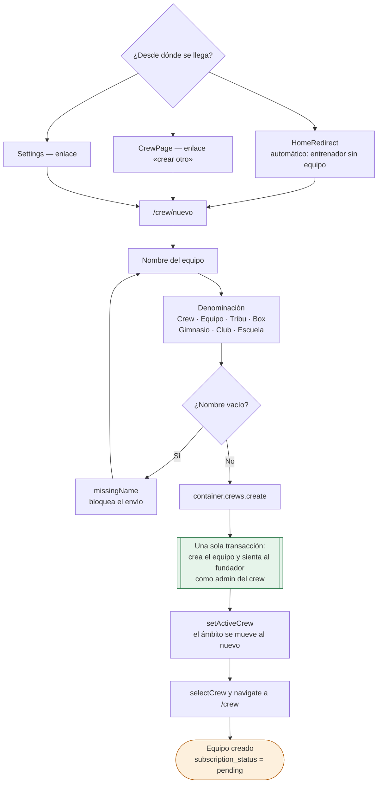
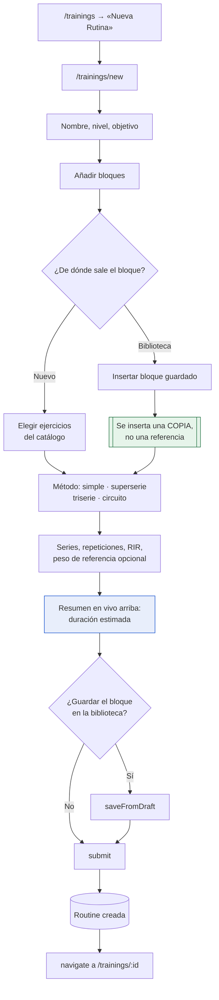
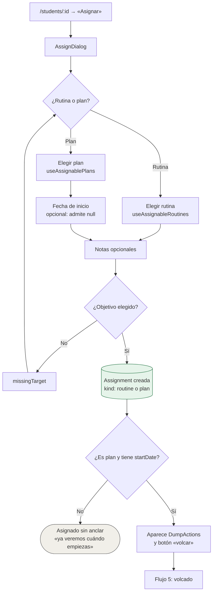
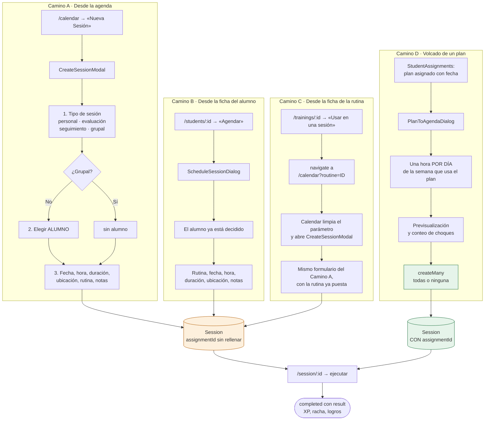
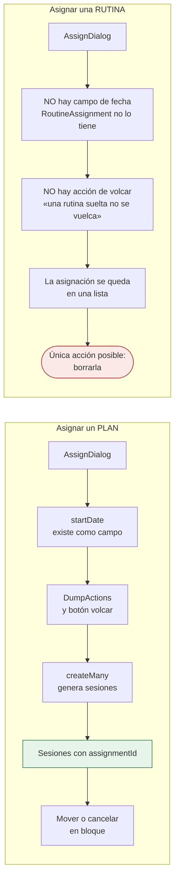

# Flujos del sistema — TrainerHub

Mapa de los procesos principales, tal como están implementados en `main`
(commit `8090004`, 10 de septiembre de 2026). No es una propuesta de cómo
deberían ser: es lo que hace el código hoy, leído fichero a fichero.

Al final, en [§8](#8-evaluación-de-eficiencia), la evaluación de cada proceso y
el diagnóstico sobre la sensación de que «no hay nada estándar».

---

## 1. El vocabulario que hay que tener claro antes de leer nada

El sistema separa **tres verbos** que se parecen y no son lo mismo. Casi todo lo
que confunde de la aplicación viene de mezclarlos, así que van primero.

| Verbo | Qué significa | ¿Ocupa un hueco en la agenda? | Entidad |
|---|---|---|---|
| **Crear** | «Existe esta rutina / este plan» | No | `Routine`, `TrainingPlan` |
| **Asignar** | «Esto es tuyo, alumno» | **No** | `Assignment` |
| **Agendar** | «Esto, este día, a esta hora» | **Sí** | `Session` |

La separación es deliberada y está documentada en el propio dominio
(`shared/domain/entities/assignment.ts`):

> «Asignar es "esto es tuyo", sin comprometer ningún hueco. Volcar un plan
> asignado a la agenda —generar sus sesiones— es una tercera acción, opcional, y
> decisión del entrenador. Que asignar generara sesiones obligaría a fijar
> horarios para poder asignar, y hay quien asigna un plan para que el alumno lo
> siga por su cuenta.»

**Un alumno puede tener a la vez** un plan asignado, tres rutinas sueltas, y
sesiones agendadas que no vienen de ninguno de los dos. El sistema no opina.

---

## 2. Mapa general: de cuenta nueva a sesión ejecutada

Este es el camino completo. Cada caja es una pantalla real; cada flecha, una
navegación que existe en el código.



**Las dependencias duras** —lo que de verdad bloquea— son sólo dos:

1. **Sin equipo no hay nada.** Todo (alumnos, rutinas, planes, sesiones) cuelga
   de un `crewId` que pone el adaptador desde el ámbito activo. Sin equipo
   activo, los repositorios devuelven listas vacías.
2. **Sin suscripción activa no entran alumnos.** Lo comprueba
   `canEnrollMembers(crew)` en el cliente y `claim_membership_as` en el
   servidor, que levanta `enrollmentClosed`.

Lo que **no** bloquea nada: se pueden crear rutinas, planes y sesiones grupales
con la suscripción en `pending`. Sólo el alta de personas está cerrada.

---

## 3. Flujo 1 — Creación de equipo

**Fichero:** `src/domains/crew/pages/NewCrew.tsx` → `useCrewEditor.createCrew`
→ `CrewRepository.create`



**Lo que está bien resuelto aquí:** la creación del equipo y el puesto de
administrador del fundador son **una sola operación atómica**. El puerto lo
documenta explícitamente porque antes eran dos escrituras desde el hook y la
segunda podía fallar, dejando «un equipo sin nadie que pudiera entrar». Con
Supabase es la función `create_crew` en una transacción.

**El estado en que queda:** `subscription_status = 'pending'`. El equipo existe,
el entrenador puede crear rutinas y planes, pero **no puede incorporar a nadie**
hasta que un administrador de plataforma lo active desde `/admin`. La página del
equipo lo explica con `SubscriptionNotice` en vez de esconder el QR — decisión
correcta: «la diferencia entre una puerta cerrada y una pared».

---

## 4. Flujo 2 — Alta de alumnos (dos vías que no se parecen)

```mermaid
flowchart TD
    subgraph VIA1["Vía A · El entrenador da de alta"]
        A1["/students → «Añadir alumno»"] --> A2["StudentFormDialog"]
        A2 --> A3["Nombre, correo, edad,<br/>nivel, objetivos"]
        A3 --> A4[("Ficha de alumno<br/>profileId = null")]
        A4 --> A5{"¿El alumno se registra<br/>luego con ese correo?"}
        A5 -->|Sí| A6["La cuenta se enlaza<br/>a la ficha existente"]
        A5 -->|No| A7["Ficha «no reclamada»<br/>el entrenador la lleva solo"]
    end

    subgraph VIA2["Vía B · El alumno se une"]
        B1["/crew → QR o código"] --> B2["El alumno escanea<br/>o escribe el código"]
        B2 --> B3["/crew/unirse"]
        B3 --> B4{"¿Suscripción activa?"}
        B4 -->|No| B5["enrollmentClosed"]
        B4 -->|Sí| B6{"¿requiresApproval?"}
        B6 -->|Sí| B7["membership_status = pending"]
        B7 --> B8["El entrenador aprueba<br/>desde /crew"]
        B6 -->|No| B9["Entra directo"]
        B8 --> B10[("Ficha de alumno<br/>profileId = la cuenta")]
        B9 --> B10
    end

    style A7 fill:#fdf0dd,stroke:#b05a00
    style B5 fill:#fbe9e7,stroke:#b3261e
```



**Las dos vías producen la misma entidad** (`Student`) pero por caminos con
propiedades muy distintas: la vía A crea una ficha sin cuenta detrás (el alumno
no puede entrar a ver su progreso hasta que se registre con ese mismo correo);
la vía B crea ficha **y** vínculo con la cuenta en el mismo acto.

Esto no está señalizado en ningún sitio de la interfaz. Un entrenador que use
sólo la vía A tendrá un roster completo de alumnos que **no pueden entrar a la
aplicación**, y nada se lo dice.

---

## 5. Flujo 3 — Creación de rutina

**Fichero:** `src/domains/trainings/pages/RoutineForm.tsx` (sirve para crear
y editar: la ruta decide).



**Dos decisiones bien tomadas aquí:**

- **El bloque de biblioteca se COPIA al insertarlo, no se referencia.** Si se
  referenciara, editar la entrada de la biblioteca cambiaría en silencio el
  programa que alguien está haciendo esta semana. En cambio el *ejercicio* sí se
  referencia por identificador: si cambia de nombre, cambia en todas partes.
  La regla del proyecto es «se referencia el vocabulario, se copia la decisión».
- **La duración estimada se calcula al escribir, arriba del formulario**, no al
  guardar. Es la cifra que decide si la sesión cabe en el hueco de la agenda.

**Prerrequisito invisible:** el catálogo (`/trainings/catalog`) es de donde
salen los ejercicios. Un entrenador nuevo tiene el catálogo de sistema sembrado,
pero **nada le lleva al catálogo antes de crear su primera rutina**, así que
descubre a mitad del formulario que le falta un ejercicio y tiene que salir.

---

## 6. Flujo 4 — Asignación (rutina o plan a un alumno)

**Fichero:** `src/domains/students/components/AssignDialog.tsx`, abierto desde
`StudentAssignments` dentro de `/students/:id`.



**Punto de entrada único, y es intencional.** `PlanDetail` **no** permite
asignar: lleva un enlace explícito a `/students` con el texto de que se asigna
desde la ficha del alumno. El comentario del código lo justifica: «es a una
persona a quien se asigna». Esto es lo contrario de «se puede hacer todo desde
cualquier sitio» — aquí hay una decisión y se respeta.

**⚠️ Un defecto real encontrado al leer este flujo.** El estado inicial de la
fecha es hoy:

```ts
const [startDate, setStartDate] = useState<Date | undefined>(() => new Date())
// «Hoy por defecto: un plan sin fecha quedaba "asignado sin empezar" y sin
//  forma de volcarlo a la agenda, y casi nadie lo cambiaba a proposito.»
```

Pero `resetForm()` —que corre **al asignar** y **al cerrar el diálogo**— la deja
en `undefined`:

```ts
const resetForm = () => {
  setStartDate(undefined)   // ← vuelve al problema que el comentario dice resolver
}
```

Resultado: el valor por defecto de «hoy» sólo aplica **la primera vez** que el
diálogo se monta. A partir de la segunda asignación en la misma sesión, la fecha
vuelve a nacer vacía y el plan queda otra vez «asignado sin empezar», sin forma
de volcarlo. Es exactamente el defecto que el comentario afirma haber corregido.

---

## 7. Flujo 5 — Agendar sesiones (cuatro caminos hacia la misma entidad)

Aquí es donde la sensación de «no hay flujo establecido» tiene su base más
sólida. **Cuatro caminos distintos producen `Session`**, y tres de ellos
desembocan en el mismo formulario o en uno casi idéntico.

Y sólo uno de los cuatro —el volcado— deja constancia de **de qué asignación
salió la sesión**. Los otros tres crean sesiones con `assignmentId` sin
rellenar: verificado, ni `CreateSessionModal` ni `ScheduleSessionDialog`
mencionan ese campo en ninguna línea.



### 7.1 Los dos formularios de sesión, comparados

| | `CreateSessionModal` (agenda) | `ScheduleSessionDialog` (ficha) |
|---|---|---|
| Pregunta **de quién** | Sí, es el primer paso | No, ya se sabe |
| **Tipo de sesión** | Sí: personal/evaluación/seguimiento/grupal | No lo pregunta |
| **Sesión grupal** | Sí, sin alumno | No es posible |
| **Rutina** | Opcional | Opcional (`sin-rutina`) |
| Fecha, hora, duración, ubicación, notas | Sí | Sí |
| Aviso de choques | `ScheduleConflictNotice` | `ScheduleConflictNotice` |
| **Origen de las duraciones** | `const DURATIONS` **local** | `SESSION_DURATIONS` del dominio |
| **Origen de horas/ubicaciones** | `calendarOptions` (reexporta el dominio) | Dominio, directo |

El código justifica la separación:

> «NO es el formulario de la agenda con otro nombre, y por eso no se comparte:
> el de la agenda empieza preguntando de quién es la sesión, y aquí eso ya está
> decidido.»

El argumento es razonable. El problema es que **la separación ya empezó a
derivar**: `CreateSessionModal` declara su propia lista de duraciones
(`const DURATIONS = ['30','45','60','90']`) mientras el dominio ya exporta
`SESSION_DURATIONS` con exactamente los mismos valores, que es la que usa el
otro formulario. Hoy coinciden. El día que alguien añada «120» a una de las dos,
no.

### 7.2 ⚠️ La asimetría entre asignar un plan y asignar una rutina

Este es el hueco más grande del sistema, y no se ve mirando las pantallas por
separado: sólo aparece al comparar los dos tipos de asignación.



**Asignar un plan tiene un ciclo de vida completo.** Asignar una rutina no tiene
ninguno. Verificado en tres sitios del código:

1. **La entidad no admite fecha.** `RoutineAssignment` extiende `AssignmentBase`
   con un único campo propio, `routineId`. `startDate` sólo existe en
   `PlanAssignment`. No es que la interfaz no lo pregunte: es que el dato no
   cabe en el tipo.

2. **No hay acción de volcado**, y es deliberado. `StudentAssignments` lo
   condiciona con `assignment.kind === 'plan'` en los dos sitios, con el
   comentario: *«Una rutina suelta tampoco se vuelca: es repertorio, no un
   programa con calendario.»*

3. **El alumno nunca ve su repertorio.** `useStudentAssignments` tiene **un solo
   consumidor** en toda la aplicación: `StudentAssignments.tsx`, que vive dentro
   de `/students/:id` — la ficha que mira **el entrenador**. No hay ninguna
   pantalla del alumno que liste lo que le han asignado.

El punto 3 es el que rompe la justificación del punto 2. «Repertorio» sería un
concepto válido —«aquí tienes tus rutinas, úsalas cuando quieras»— **si el
alumno pudiera verlas**. Como no puede, una rutina asignada es un apunte privado
del entrenador sobre el que la única operación disponible es borrarlo.

Y cuando el entrenador sí agenda esa rutina para ese alumno, lo hace por
cualquiera de los caminos A, B o C, que **no consultan ni actualizan la
asignación**: la sesión nace con `assignmentId` vacío. La lista de asignaciones
del alumno y su lista de sesiones son dos vistas que nunca se hablan.

---

## 8. Evaluación de eficiencia

### 8.1 Proceso por proceso

| Proceso | Pasos mínimos | Puntos de entrada | Estado | Nota |
|---|---|---|---|---|
| **Crear equipo** | 3 (nombre, denominación, enviar) | 3 (auto, CrewPage, Settings) | 🟢 Eficiente | Atómico, sin estados intermedios rotos |
| **Activar suscripción** | 1 petición + espera indefinida | 1 | 🔴 Bloqueante | Depende de una acción manual de otra persona, sin plazo ni aviso |
| **Alta de alumno (vía A)** | 2 (abrir, rellenar) | 2 | 🟡 Correcto | Produce fichas sin cuenta y no lo advierte |
| **Alta de alumno (vía B)** | 3–4 (QR, código, aprobación) | 1 | 🟢 Eficiente | Bien resuelto, con aprobación opcional |
| **Crear rutina** | 4+ (nombre, bloques, ejercicios, guardar) | 1 | 🟢 Eficiente | Copia vs referencia bien decidido |
| **Asignar** | 3 (tipo, objetivo, enviar) | **1** | 🟢 Eficiente | Punto único deliberado. Con un defecto de fecha |
| **Agendar (agenda)** | 6–7 campos | 1 | 🟡 Correcto | El formulario más largo del sistema |
| **Agendar (ficha)** | 5–6 campos | 1 | 🟡 Duplicado | Mismo acto, otro formulario |
| **Volcar plan** | 1 hora por día usado | 1 | 🟢 Eficiente | Transaccional, con previsualización de choques |
| **Ejecutar sesión** | Guiado por bloques | 1 | 🟢 Eficiente | Cierra el bucle: XP, racha, logros |

### 8.2 El diagnóstico sobre «no hay nada estándar»

Después de leer los flujos completos, la respuesta honesta es **mitad y mitad**,
y conviene separar las dos mitades porque piden arreglos opuestos.

#### Donde la intuición NO se sostiene: el modelo de dominio sí es estándar

El sistema tiene un modelo de tres verbos —crear, asignar, agendar— aplicado con
disciplina, documentado en el código, y **respetado incluso cuando resultaba
incómodo**:

- Asignar tiene **un solo punto de entrada** en toda la aplicación. `PlanDetail`
  podría haber añadido un botón «asignar» y no lo hizo: puso un enlace a la
  lista de alumnos con la razón escrita.
- Crear y editar rutina son **una sola página**, no dos que se separan al primer
  cambio.
- El volcado de un plan es `createMany` transaccional, no un bucle de altas.
- Las entidades impiden estados ilegales por construcción (`Assignment` es una
  unión discriminada; no se puede representar una asignación de rutina con fecha
  de plan).

Eso no es una aplicación donde «se puede hacer todo desde cualquier sitio». Es
una aplicación con un modelo fuerte.

#### Donde la intuición SÍ acierta: la superficie de la interfaz no lo refleja

El problema no está en el modelo, está en que **nada en la interfaz enseña el
modelo**. Cuatro síntomas concretos:

1. **No existe un camino guiado de primera vez.** Un entrenador recién
   registrado aterriza en «crear equipo» y a partir de ahí está solo. La
   secuencia real —equipo → activar suscripción → catálogo → rutina → alumnos →
   asignar → volcar— existe en el código pero **en ningún sitio de la
   aplicación**. Cada pieza es alcanzable desde el menú; ninguna dice qué va
   antes ni qué va después. De ahí la sensación de «se puede hacer todo desde
   donde sea»: es literalmente cierto, porque no hay orden sugerido.

2. **Dos formularios para agendar, con la deriva ya empezada.** La justificación
   de la separación es defendible, pero la duplicación de `DURATIONS` demuestra
   el coste: dos sitios que hay que acordarse de cambiar a la vez.

3. **Las dependencias son invisibles hasta que muerden.** La suscripción en
   `pending` no impide crear rutinas ni planes; impide incorporar alumnos. Un
   entrenador puede pasar una hora construyendo su catálogo y sus rutinas y
   descubrir al final que no puede dar de alta a nadie. El aviso existe
   (`SubscriptionNotice`) pero vive en `/crew`, que no es donde está trabajando.

4. **Las dos vías de alta de alumno producen resultados distintos y no se
   distingue.** Alta manual = ficha sin cuenta. QR = ficha con cuenta. La
   diferencia decide si el alumno puede entrar o no, y no se dice en ninguna
   parte.

### 8.3 Qué haría falta, por orden

| # | Qué | Por qué primero |
|---|---|---|
| 1 | **Arreglar el `resetForm` de `AssignDialog`** | Es un defecto real, de una línea, que reintroduce un problema ya diagnosticado |
| 2 | **Unificar `DURATIONS` con `SESSION_DURATIONS`** | Una línea. Detiene la deriva antes de que cueste |
| 3 | **Una lista de «primeros pasos» en el panel** mientras falten piezas: equipo ✓, suscripción ⧗, catálogo, primera rutina, primer alumno | Convierte el modelo implícito en un flujo visible sin quitar libertad de navegación |
| 4 | **Decir en el alta manual que la ficha no tiene cuenta** y cómo se enlaza | Evita un roster entero de alumnos que no pueden entrar |
| 5 | **Llevar el aviso de suscripción a donde estorba**: al intentar dar de alta un alumno, no sólo en `/crew` | El aviso tiene que aparecer donde se toma la decisión |
| 6 | **Extraer el tronco común de los dos formularios de sesión** (campos de cuándo/dónde/cuánto) dejando cada uno con su cabecera propia | Conserva la separación justificada sin pagar la duplicación |

---

## 9. Lo que este documento no cubre

- **Progreso, XP y logros**: el bucle se cierra al completar una sesión, pero
  las reglas viven en `progressRules.ts` y merecen su propio mapa.
- **El muro del equipo y los avisos**: son flujo de comunicación, no de
  entrenamiento.
- **El panel de plataforma** (`/admin`): activar suscripciones y gestionar
  cuentas, que es un rol distinto.
- **Cuotas y cobros**: `StudentSubscription` lleva quién vence y cuándo, no
  cuánto. Sin importes no hay flujo de cobro que documentar.

---

*Verificado leyendo el código en `main` (`8090004`). Cada afirmación sobre
comportamiento sale de un fichero concreto, citado en el encabezado de su
sección.*
