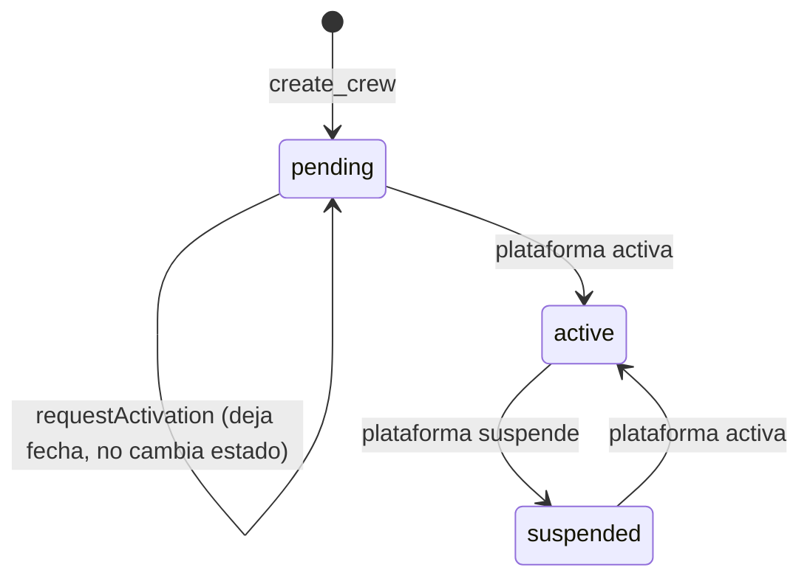
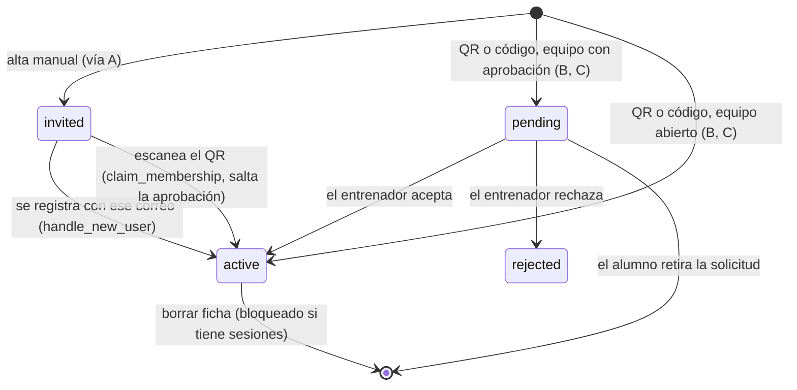
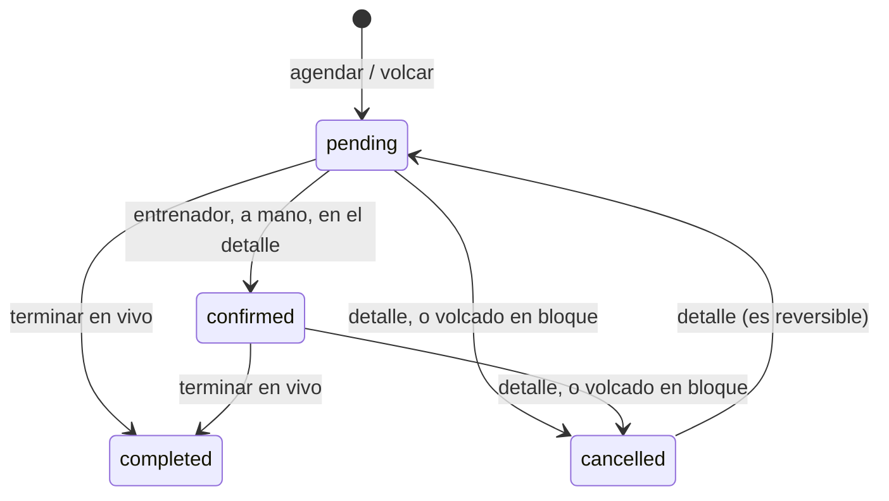
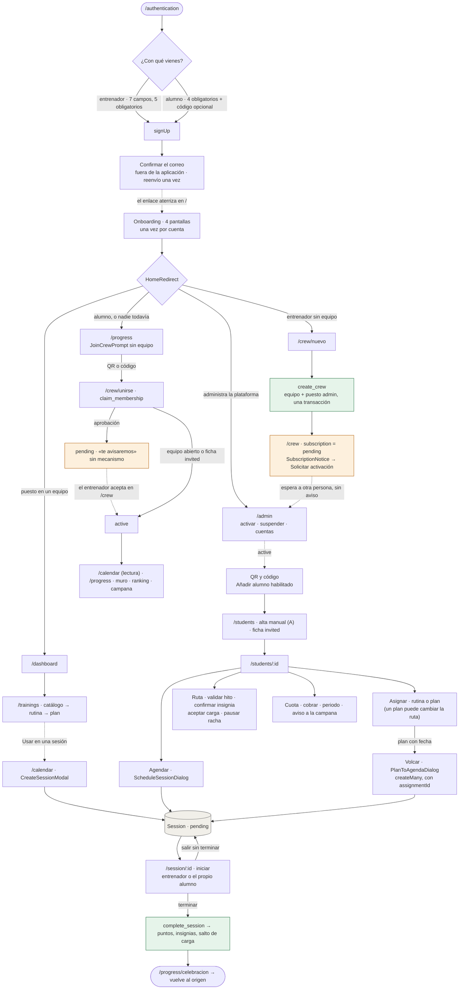

# Flujos del sistema — TrainerHub

Mapa de los procesos principales tal como están implementados en `main`
(commit `8090004`, 10 de septiembre de 2026), contrastado fichero a fichero por
segunda vez. La primera lectura está en el historial de este fichero (commit
`614c0d0`). Esta versión corrige lo que aquélla afirmaba sin verificar y añade
lo que no miraba: el lado del alumno, los estados por los que pasa cada entidad,
los relevos entre personas, lo que ocurre cuando una escritura falla, y qué
prueba fija cada flujo.

No es una propuesta de cómo deberían ser los flujos. Es lo que el código hace
hoy. Las propuestas van al final, en [§9](#9-plan-de-acción-priorizado), y
están ordenadas.

**Método.** Cada afirmación sale de una de estas tres fuentes, y se cita:

- el componente o hook que pinta o decide (`src/domains/…`, `src/app/…`);
- la función o política del servidor que lo permite o lo niega
  (`supabase/migrations/…`), porque el cliente sólo esconde lo que va a fallar
  y quien decide es la base;
- la prueba que lo fija (`tests/visual/screenshots.spec.ts` para la interfaz,
  `tests/contract/*.contract.test.ts` para el servidor).

Lo que no tiene una de las tres detrás no está aquí.

**Cómo leer los veredictos de §0.** ✅ confirmado · ⚠️ matizado (era cierto en
parte) · ❌ incorrecto.

---

## 0. Fe de erratas de la primera lectura

| # | Afirmación de la primera lectura | Lo que hace el código | Veredicto |
|---|---|---|---|
| 1 | «Crear equipo tiene 3 puntos de entrada: automático, CrewPage y Settings» | Los tres existen **sólo mientras no se tiene equipo**. `HomeRedirect` desvía sin equipo; `CrewPage` enseña «crear» sólo en su estado `NoCrew`; `Settings` sólo cuando `crewNone`; y `CrewSwitcher` ofrece «unirse a otro», no «crear otro». Con un equipo ya creado no hay ninguna puerta a `/crew/nuevo`: hay que teclearla. El caso del «segundo local» que razona `crew.ts` no tiene interfaz. | ❌ |
| 2 | «Activar suscripción: 1 petición + espera indefinida, sin plazo ni aviso» | La petición existe (`useCrewEditor.requestActivation` → `crews.activation_requested_at`), el panel de plataforma ordena los equipos por fecha de petición, y el texto dice «Te avisaremos cuando esté lista». Lo que no existe es el aviso: ni `notice`, ni correo, ni push. Si `/crew` está abierta, el tiempo real repinta el QR; si no, nadie se entera. | ⚠️ |
| 3 | «Alta manual: nombre, correo, edad, nivel, objetivos» | Siete campos: nombre, apellido, correo, nivel, **fecha de nacimiento** (la edad se deriva con `ageOf`), % graso y objetivos. Tres obligatorios. La ficha nace `membershipStatus: 'invited'`, `profileId: null`. | ⚠️ |
| 4 | «Que la ficha manual no tiene cuenta no está señalizado en ningún sitio» | Lo dice el formulario («Con este correo se enlazará su cuenta cuando se registre») y lo marca `/crew` («Sin cuenta», con botón para copiar el enlace). Lo que no lo dice es la lista de alumnos ni la ficha, que es donde el entrenador pasa el día: `StudentCard` no pinta ni pertenencia ni cuenta. | ⚠️ |
| 5 | «Hay dos vías de alta de alumno» | Hay tres. La tercera es el **código escrito en el formulario de registro** (`StudentRegisterForm.joinCode`), que el servidor honra dentro de `handle_new_user`. Y falla en silencio: un código inválido se traga con `exception when others then null`, y con la confirmación por correo activada el cliente no tiene sesión para enterarse. | ❌ |
| 6 | «Nada le lleva al catálogo antes de crear su primera rutina» | El catálogo de sistema viene sembrado, `Trainings` tiene el botón «Catálogo» y `RoutineForm` enseña la puerta cuando el catálogo está vacío. Lo que sigue siendo cierto: descubrir a medio formulario que falta un ejercicio obliga a salir, y el borrador **se pierde** al salir (`useRoutineDraft` no persiste). | ⚠️ |
| 7 | «`resetForm` de `AssignDialog` vacía la fecha por defecto» | Confirmado. Y hay un segundo camino: `changeKind` también la pone a `undefined`, así que ya en la primera apertura basta pulsar «Rutina» y volver a «Plan» para perder el «hoy». | ✅ |
| 8 | «Asignar no tiene efectos más allá de la lista» | Asignar un plan **cambia la ruta de desarrollo** del alumno: `route_of_student` toma el objetivo del último plan asignado (`route_objectives`), salvo que el entrenador haya elegido ruta a mano en `student_routes`. Las validaciones de hito son por ruta, así que el nodo que el alumno ve puede bajar. `AssignDialog` no lo dice. | ❌ |
| 9 | «Cuatro caminos hacia `Session`» | Cinco entradas y tres formularios. A las cuatro se suma el **menú de la tarjeta** («Agendar sesión» abre la ficha con `?agendar`). Y «Editar» desde el detalle reutiliza el formulario de la agenda con la sesión puesta. | ⚠️ |
| 10 | «El formulario de la ficha pregunta rutina, fecha, hora, duración, ubicación y notas» | Pregunta además la **modalidad** (fuerza / cardio), igual que el de la agenda. | ⚠️ |
| 11 | «La deriva entre los dos formularios es `DURATIONS`» | Son tres derivas: `DURATIONS` local; dos textos sin traducir en la ficha («Para {nombre}. Aparecerá en el calendario.» y «ocupado ·») donde la agenda usa `t()`; y el manejo de errores: la agenda captura el fallo y lo enseña con `toast`, y confirma el éxito; la ficha no captura nada y no confirma nada. | ⚠️ |
| 12 | «Sólo el volcado deja `assignmentId`» | Confirmado por búsqueda: ni `CreateSessionModal` ni `ScheduleSessionDialog` lo mencionan. | ✅ |
| 13 | «El alumno nunca ve su repertorio» | Confirmado: `useStudentAssignments` tiene un consumidor. Y la política de lectura de `assignments` **sí** deja al alumno leer las suyas, así que el dato viaja y ninguna pantalla lo pinta. | ✅ |
| 14 | «El aviso de suscripción vive en `/crew`, que no es donde se trabaja» | Vive también en `/students`: «Añadir alumno» sale apagado y debajo se lee por qué (`students.needsSubscription`). Y el registro de entrenador lo anuncia antes de crear la cuenta (`register.trainer.hint`). Donde no está es en `/trainings` ni en el panel. | ❌ |
| 15 | «Al completar: XP, racha y logros; las reglas viven en `progressRules.ts`» | Los puntos y las insignias los escribe la base al cerrar (`sessions_score` → `score_session` y `evaluate_badges`); el cliente los lee por `ScoreRepository` y `BadgeRepository`. `progressRules` conserva la racha y el nivel, que son presentación. | ⚠️ |
| 16 | «Agendar desde la ficha: 1 punto de entrada» | Dos: el botón de cabecera de la ficha y el menú de la tarjeta en la lista. | ⚠️ |

---

## 1. El vocabulario

El sistema separa **tres verbos** que se parecen y no son lo mismo:

| Verbo | Qué significa | ¿Ocupa hueco en la agenda? | Entidad |
|---|---|---|---|
| **Crear** | «Existe esta rutina / este plan» | No | `Routine`, `TrainingPlan` |
| **Asignar** | «Esto es tuyo, alumno» | **No** | `Assignment` |
| **Agendar** | «Esto, este día, a esta hora» | **Sí** | `Session` |

Documentado en `shared/domain/entities/assignment.ts`: volcar un plan asignado
a la agenda es una tercera acción, opcional, y decisión del entrenador. Un
alumno puede tener a la vez un plan, tres rutinas sueltas y sesiones que no
salen de ninguno de los dos.

Dos cosas más que hay que tener claras porque aparecen en los flujos:

- **La ficha es la pertenencia.** No hay tabla de miembros para alumnos:
  `Student.crewId` y `Student.membershipStatus` son la relación. Una persona en
  dos equipos tiene dos fichas y un solo `profileId` (`student.ts`).
- **Hay dos suscripciones y no se parecen.** `Crew.subscriptionStatus` es la
  del equipo con la plataforma: la activa un administrador de plataforma y abre
  la puerta a incorporar gente. `StudentSubscription` es la cuota del alumno con
  su equipo: la cobra su entrenador y no desbloquea nada
  (`studentSubscription.ts`).

---

## 2. Actores, capacidades y quién decide

| Actor | Cómo se es | Qué puede |
|---|---|---|
| Administrador de plataforma | `profiles.role = 'admin'`, lo da `handle_new_user` a quien esté en `platform_admin_emails` | Activar y suspender suscripciones de equipos; gestionar cuentas. No lee datos de alumnos ajenos. |
| Administrador del equipo | Puesto `admin` en `crew_staff`; quien crea el equipo nace así | Las ocho capacidades |
| Entrenador | Puesto `trainer` en `crew_staff` | Seis: `crew.invite`, `crew.members`, `crew.wall`, `training.manage`, `schedule.manage`, `students.manage`. Sin `crew.settings` ni `crew.staff`. |
| Alumno | Ficha en `students` con `profileId` | Ninguna capacidad. Ve su agenda, su progreso, el muro y el ranking. Cierra sus propias sesiones. |
| Sin equipo | Cuenta sin puesto ni ficha | Calendario y Progreso vacíos, y la invitación a unirse |

Las concesiones (`extraCapabilities`) **sólo suman**: se le presta una llave a
alguien sin ascenderlo (`permissions.ts`).

**Quién decide.** El cliente pregunta `can(...)` para no ofrecer lo que va a
fallar. Quien decide es la base: RLS con `has_capability`, y tres disparadores
que fijan qué columnas puede tocar cada uno —`guard_student_update`,
`guard_session_update`, `guard_last_admin`—. Las operaciones que cruzan filas
son funciones: `create_crew`, `claim_membership`, `create_sessions`,
`complete_session`, `validate_milestone`, `validate_badge`, `accept_load_jump`,
`pause_streak`, `use_streak_wildcard`, `platform_set_subscription`. Cada una
tiene prueba de contrato.

---

## 3. Los estados por los que pasa cada cosa

Es la parte que la primera lectura no miró, y donde están los huecos más caros:
**varios ciclos de vida no tienen estado final.**

### 3.1 La suscripción del equipo

- Sólo la mueve `platform_set_subscription` tras `assert_platform_admin`. El
  equipo puede **pedir** (`requestActivation`) y nada más.
- `pending` y `suspended` se explican distinto en `SubscriptionNotice`, y con
  razón: a uno le falta la activación, al otro se le retiró.
- En `suspended` los alumnos siguen, se les agenda y se les cobra; sólo se
  cierra la entrada (`canEnrollMembers`, y `claim_membership_as` con
  `enrollmentClosed`).

### 3.2 La pertenencia del alumno

Tres cosas que este diagrama deja a la vista:

1. **No hay baja.** `MembershipStatus` es `invited | pending | active |
   rejected`. La capacidad `crew.members` se describe como «aceptar o rechazar
   solicitudes, y dar de baja a un alumno», pero `updateMembership` sólo se
   llama con `active` y `rejected` (`useCrewMembers`). Un alumno que deja el
   gimnasio y tiene una sola sesión no se puede borrar
   (`useStudentEditor.deletionBlocker`) ni desactivar: sigue contando en
   «alumnos» del panel, en la cola de cobros y arriba del todo en retención.
2. **El alumno activo no puede irse.** `withdrawRequest` sólo borra una ficha
   `pending` (política «una solicitud pendiente la retira quien la hizo»). La
   única salida de un equipo es eliminar la cuenta entera.
3. **El rechazo es invisible.** Una ficha `rejected` no llega a `useViewer`
   (la simulación la filtra; contra Supabase, `belongs` y `pending` la
   descartan). El alumno rechazado vuelve a ver «Únete a un equipo» como si
   nunca hubiera pedido nada, y lo normal es que vuelva a escanear.

Y una que no se ve en el diagrama: **una ficha `invited` que escanea el QR entra
sin aprobación** aunque el equipo la exija (`claim_membership_as`: «quien ya
estaba dentro no vuelve a la cola»). Es correcto —el entrenador ya la dio de
alta— pero conviene saberlo.

### 3.3 La sesión

- `completed` y `cancelled` son finales de verdad: una completada no se vuelve
  a ejecutar (`LiveSession` y `SessionDetailsModal` lo cierran; el disparador
  `guard_session_update` deja al alumno escribir sólo `completed` con su
  resultado).
- **No hay caducidad.** Una sesión `pending` cuyo día pasó sigue `pending`
  para siempre. Cuenta como «por hacer» en `DumpActions`, así que «Mover una
  semana» la mueve a otro día ya pasado, y «Cancelar las pendientes» cancela
  también lo que ya no ocurrió. Retención no la mira (usa `completedAt`), pero
  el contador de pendientes de la agenda sólo crece. No existe «no vino».
- `confirmed` **no lo consume nada**: cambia el color, cuenta en el resumen, y
  el onboarding promete algo que no hace (§6.3). Es un paso manual opcional
  sin consecuencia.

### 3.4 Lo demás

| Entidad | Estados | Quién los mueve | Final |
|---|---|---|---|
| `Assignment` (plan) | con `startDate` / sin ella | el entrenador, sólo al crearla (no se edita) | borrar; no toca las sesiones ya volcadas |
| `Assignment` (rutina) | ninguno | — | borrar. Única acción posible. |
| `SessionScore` | puntuada / `flagged_reason = load_jump` → revisada | la base al cerrar; `accept_load_jump` con `students.manage` | revisada |
| `StudentBadge` | desbloqueada / pendiente de validación (Platino, Diamante) → validada | la base; `validate_badge` | validada |
| Nodo de ruta | derivado: puntos + semanas ≥ 85 % + hito validado | `validate_milestone`; la ruta la mueve `choose_route` o el objetivo del último plan | nodo 4 |
| Racha | día a día, protegida por pausas y descansos de plan | la base; `pause_streak` (gestión), `use_streak_wildcard` (alumno, uno por 8 semanas hasta 2) | — |

---

## 4. Mapa general

Cada caja es una pantalla o un paso real; cada flecha, una navegación o una
escritura que existe. El entrenador arriba, el alumno abajo, la plataforma en el
medio.

**Las dependencias duras** —lo que de verdad bloquea— siguen siendo dos, y las
dos están bien puestas:

1. **Sin equipo no hay nada.** Todo cuelga de un `crewId` que pone el adaptador
   desde el ámbito (`crewScope`). Sin equipo activo los repositorios devuelven
   vacío, y `createMany` levanta `noActiveCrew`.
2. **Sin suscripción activa no entran alumnos.** `canEnrollMembers` en el
   cliente —QR, alta manual, unirse— y `claim_membership_as` en el servidor con
   `enrollmentClosed`. Rutinas, planes, catálogo y sesiones grupales no
   dependen de ella.

---

## 5. Los flujos, uno a uno

Cada flujo se lee con la misma plantilla: por dónde se entra, qué pasos tiene,
qué lo controla (cliente y servidor), en qué estado deja las cosas, a quién hay
que esperar, qué pasa si la escritura falla, y qué prueba lo fija. Al final de
cada uno, los hallazgos de esta lectura.

### 5.1 Registro, confirmación y primera entrada

**Ficheros:** `auth/pages/Authentication.tsx`, `RegisterIntentChooser`,
`TrainerRegisterForm` / `StudentRegisterForm`, `useRegisterForm`,
`ConfirmEmailNotice`, `app/layouts/RootLayout.tsx` (guardia de onboarding),
`app/routes/HomeRedirect.tsx`. Servidor: `handle_new_user`.

**Pasos.**

1. Pestaña «Registrarse» → elegir intención: entrenador o alumno. Las dos
   opciones pesan igual a propósito.
2. Entrenador: 7 campos, 5 obligatorios (nombre, apellido, correo, contraseña,
   especialidad). Alumno: 4 obligatorios + código de equipo opcional. La lista
   de obligatorios es una constante compartida por formulario y validación
   (`REQUIRED_BY_INTENT`).
3. `signUp` con el perfil dentro. El servidor, en la misma transacción, crea
   `profiles`, **reclama las fichas `invited` con ese correo en cualquier
   equipo** (pasan a `active`), y honra el código de equipo si lo hay.
4. Con confirmación por correo activada no hay sesión: se sustituye el
   formulario por `ConfirmEmailNotice`, que enseña la dirección (para detectar
   una errata) y ofrece reenviar **una vez**.
5. El enlace del correo aterriza en `/` con sesión. `RootLayout` comprueba
   `onboarded_at`; si falta, `/onboarding` (4 pantallas, «Saltar» también lo
   marca visto). Después `HomeRedirect` decide por papel: `/admin`,
   `/dashboard`, `/crew/nuevo` (entrenador sin equipo) o `/progress`.

**Controles.** Confirmación por correo (Supabase); límite horario de envíos
del proveedor; lista blanca de redirecciones en el panel; `handle_new_user`
sólo reclama fichas sin dueño (`profile_id is null and membership_status =
'invited'`), nunca una ya enlazada.

**Esperas.** Al correo, que es externo, tiene límite por hora y no se ve desde
la aplicación.

**Si falla.** El error del alta se enseña en el formulario. El código de equipo
inválido en el registro **no**: el servidor lo ignora, y como no hay sesión el
cliente no puede llevar a `/crew/unirse` con el código puesto (ese camino,
`joinWithCode`, sólo corre cuando el proveedor abre sesión, es decir, en la
simulación).

**Pruebas.** `onboarding` (e2e); `account`, `profiles`, `students`
(`claimByEmail`) en contratos. El registro con confirmación no es simulable en
la suite de interfaz.

**Hallazgos.**

- **El QR se pierde en el camino más frecuente.** Alguien sin cuenta escanea el
  QR → `/crew/unirse?codigo=X` → `ProtectedRoute` guarda la ruta pretendida →
  se registra → confirma el correo → el enlace aterriza en `/` y la ruta
  pretendida ya no existe (deuda anotada en `CLAUDE.md`). El formulario de
  registro tiene un campo para el código, pero **no lo rellena** desde la ruta
  pretendida, así que la persona tiene que copiarlo a mano de una URL que ya no
  ve, o volver a pedir el QR. Rellenar `joinCode` desde `readIntendedPath`
  cierra el hueco sin tocar el servidor.
- Un código inválido escrito en el registro se pierde en silencio (§0 #5).

### 5.2 Equipo y suscripción

**Ficheros:** `crew/pages/NewCrew.tsx`, `useCrewEditor`, `crew/pages/CrewPage.tsx`,
`SubscriptionNotice`, `CrewInviteCard`, `platform/components/PlatformCrews.tsx`.
Servidor: `create_crew`, `platform_set_subscription`, `rotate_join_token`.

**Pasos.** Nombre y denominación (siete opciones, «Crew» por defecto) →
`create_crew` crea el equipo **y** sienta al fundador como `admin` en una
transacción → `setActiveCrew` → `/crew`. El equipo nace `pending`.

En `/crew`, quien tiene `crew.invite` ve el QR si `canEnrollMembers`, y si no
`SubscriptionNotice` en su lugar: explica el estado, y en `pending` ofrece
«Solicitar la activación», que deja fecha y la enseña. El administrador de
plataforma ve en `/admin` los equipos esperando, ordenados por fecha de
petición, y activa o suspende.

**Controles.** `create_crew` exige sesión; los ajustes exigen `crew.settings`;
la suscripción sólo la toca `platform_set_subscription` tras
`assert_platform_admin`. Rotar el QR pide una segunda pulsación en el sitio.

**Esperas.** A otra persona, sin plazo, sin aviso (§6.1).

**Si falla.** `useCrewEditor.run` captura y enseña en un `Alert`. Correcto.

**Pruebas.** `equipo` (e2e); `crews` (contrato: `create_crew`, rotación, límite
de veinte consultas del token, `requestActivation`).

**Hallazgos.**

- Un segundo equipo no se puede crear desde la interfaz (§0 #1).
- «Te avisaremos cuando esté lista» no tiene mecanismo detrás (§6.3).
- Dos textos sin traducir en `NewCrew` y `JoinCrew` (párrafos de introducción)
  y cuatro en `CrewPage` («miembro/s», «Solicitudes ·», y los `aria-label` de
  aceptar y rechazar).

### 5.3 Alta de alumnos: tres vías, la aprobación, y la baja que no existe

**Ficheros:** `students/pages/Students.tsx`, `StudentFormDialog`,
`crew/pages/JoinCrew.tsx`, `useJoinCrew`, `useCrewMembers`,
`progress/components/JoinCrewPrompt.tsx`, `useWithdrawRequest`. Servidor:
`claim_membership` / `claim_membership_as`, `find_crew_by_join_token`,
`handle_new_user`, `guard_student_update`.

**Vía A — el entrenador da de alta.** `/students` → «Añadir alumno» (apagado
sin `crew.invite` o sin suscripción activa, y con el motivo escrito debajo) →
7 campos, 3 obligatorios → ficha `invited` sin cuenta. Se enlaza sola cuando
esa persona se registra con ese correo (disparador) o escanea el QR
(`claim_membership_as` la reclama y la deja `active` sin pasar por aprobación).
El formulario lo explica; `/crew` la marca «Sin cuenta» y ofrece copiar el
enlace de invitación; la tarjeta y la ficha no dicen nada.

**Vía B — el alumno se une con sesión.** El QR codifica
`/crew/unirse?codigo=…`, así que la cámara del móvil abre la pantalla con el
código puesto y **se envía solo**; también se escribe a mano. `useJoinCrew`:
`findByJoinToken` (veinte consultas por cuenta y hora; después
`tooManyAttempts`; un código que no existe y uno rotado se responden igual) →
`canEnrollMembers` (el mensaje no menciona la suscripción: no es asunto del
alumno) → ¿ya era miembro activo? «Ya eras de este equipo» → `claimMembership`
con `pending` o `active` según `requiresApproval`. Tres desenlaces con texto
propio; «Ver mi progreso» o «Entendido».

Con solicitud pendiente, `/progress` cambia la invitación por «Esperando a
{equipo}», con dos salidas: retirar la solicitud (política de borrado sobre la
propia fila `pending`) o escribir otro código.

**Vía C — el código en el registro.** Ver §5.1.

**Aprobación.** Quien tiene `crew.members` ve en `/crew` la sección
«Solicitudes» **cuando hay alguna**, con aceptar y rechazar. No hay contador ni
aviso en ningún otro sitio: ni en el panel, ni en la barra, ni en la insignia
del equipo (que sólo cuenta anuncios del muro sin leer). `approve` y `reject`
se llaman con `void` y sin captura.

**Baja.** No existe (§3.2). «Eliminar» en la tarjeta está bloqueado en cuanto
hay una sesión, y no hay estado de inactivo.

**Controles del servidor.** Insertar ficha exige `students.manage`;
`guard_student_update` reparte columnas: pertenencia con `crew.members`,
concesiones con `crew.staff`, valoración con `students.manage`, y nombre, foto
y fecha de nacimiento los cambia el propio alumno. `claim_membership_as`
valida el token en la misma transacción que escribe (entre leer y escribir no
cabe una rotación).

**Pruebas.** `equipo`, `tarjeta de estudiante` (e2e); `students` (contrato:
reclamación por correo y por QR, aprobación, retirada, guardia de columnas),
`crews` (límite del token).

**Hallazgos.**

- Sin baja ni salida voluntaria (§3.2). Esto **contamina tres métricas**: el
  panel cuenta `students.length` (incluye `invited` que nunca entraron),
  retención lista a quien nunca entrenó arriba del todo, y la cola de cobros
  reclama a quien ya no viene.
- Rechazo invisible para el alumno (§3.2).
- Solicitudes sin señal fuera de `/crew` (§6.2).
- La tarjeta del alumno no dice si tiene cuenta ni en qué estado está su
  pertenencia (§0 #4).
- **La puerta del alta no pregunta lo mismo en el cliente que en la base.**
  `Students` habilita «Añadir alumno» con `crew.invite`; la política de
  inserción de `students` exige `students.manage`. Para `admin` y `trainer` da
  igual, porque tienen las dos; a quien se le preste sólo `crew.invite` le
  saldrá el botón y le fallará la escritura.

### 5.4 Catálogo, rutina y plan

**Ficheros:** `trainings/pages/TrainingCatalog.tsx`, `RoutineForm.tsx`,
`RoutineDetail.tsx`, `PlanForm.tsx`, `PlanDetail.tsx`, `useTrainingDeletion`.

**Catálogo.** Cuatro pestañas: ejercicios y material (del entrenador,
editables, protegidos si alguna rutina los prescribe), bloques guardados, y la
referencia del sistema (sólo lectura). Se entra desde el botón secundario de
`/trainings`. El catálogo de sistema viene sembrado.

**Rutina.** Una página para crear y editar (`/trainings/new`,
`/trainings/:id/edit`); todo dentro de un `<form>`. Identidad (nombre, nivel,
descripción) → bloques (nuevo, o insertado **como copia** desde la biblioteca) →
método (simple, superserie, triserie, circuito) → series, repeticiones, RIR,
tempo, indicaciones, carga de referencia → resumen en vivo arriba con la
duración estimada → guardar → `/trainings/:id`. Desde la ficha: «Usar en una
sesión» (→ `/calendar?routine=id`), editar, borrar (bloqueado si un plan la
programa). **No hay pista de cómo se asigna**, a diferencia de la ficha del
plan.

**Plan.** Identidad (objetivo, división, frecuencia, nivel) → semanas
(añadir copia la anterior; descarga por semana) → una rutina por día → guardar
→ `/trainings/plans/:id`. La ficha dice «Un plan se asigna desde la ficha de
cada alumno» con enlace a `/students`. Sin rutinas no se puede componer y se
dice con la puerta. Borrar está bloqueado si está asignado (cliente y
`on delete restrict`).

**Si falla.** Las altas de rutina y plan no capturan el error del puerto: un
rechazo deja el formulario tal cual, sin mensaje.

**Pruebas.** La sección mejor cubierta: `creacion de rutinas`, `edicion de
rutinas`, `catalogo del entrenamiento`, `biblioteca de bloques`, `planes`,
`ficha de plan`, `borrado`, `usar una rutina en una sesion` (e2e); `training`
(contrato).

**Hallazgos.**

- El borrador de rutina se pierde al salir al catálogo (§0 #6). No hay alta de
  ejercicio en línea desde el bloque.
- Asimetría de las fichas: el plan explica cómo se asigna, la rutina no.
- Textos sin traducir: «Rutinas», «Planes» (enlaces de vuelta), «descanso»,
  «min estimados», «series en total», `kind="la rutina"` / `"el plan"`, y
  «guardado en la biblioteca» en el formulario.

### 5.5 Asignar

**Ficheros:** `students/components/AssignDialog.tsx`, `StudentAssignments.tsx`,
`useStudentAssignments`. Servidor: política «las asignaciones las escribe quien
gestiona entrenamiento»; lectura para el equipo técnico y **para el propio
alumno**.

**Un solo punto de entrada**, y es intencional: la ficha del alumno. Plan por
defecto, o rutina; elegir; en plan, fecha de inicio con calendario («Hoy, si no
se cambia»); notas. Sin objetivo elegido se marca `missingTarget`. Sin planes o
rutinas se dice, con enlace a crearlos.

**Lo que deja.** Una fila en la lista, con rótulo de tipo, enlace al plan o la
rutina (o «ya no disponible»), y el cuándo: «Empieza el …», «Asignado, sin
fecha de inicio», o «Rutina, desde …». Volcar sólo aparece en planes con fecha.
Borrar siempre. Borrar no toca las sesiones ya volcadas.

**El efecto que no se ve.** `route_of_student` toma el objetivo del **último
plan asignado** (`route_objectives`: fuerza → Titan, resistencia → Endurance…)
salvo ruta elegida a mano. Asignar un segundo plan con otro objetivo mueve al
alumno de ruta. Los puntos se conservan (sin ruta elegida, `route_since` es
1900), pero las validaciones de hito son por ruta, así que un alumno en
Consolidación de Titan aparece en Iniciación de Endurance hasta que el
entrenador valide de nuevo. La ruta se ve en `/progress` y en
`StudentRouteSection`; `AssignDialog` no la menciona.

**Si falla.** `onAssign` y `unassign` se esperan sin captura: la escritura
rechazada no se dice, el diálogo se queda abierto, y no hay confirmación al
asignar. `useStudentAssignments` captura el error de lectura en `error` y
`StudentAssignments` no lo pinta.

**Pruebas.** `asignaciones del alumno` (e2e: asignar no crea sesiones, se
acumulan, quitar no toca la agenda); `routes` (contrato: la ruta sale del
plan).

**Hallazgos.**

- La fecha por defecto se pierde en `resetForm` y en `changeKind` (§0 #7).
- Sin feedback de éxito ni de fallo.
- Efecto sobre la ruta sin aviso (§0 #8).
- Una rutina asignada sigue sin ciclo de vida: sin fecha, sin volcado, sin
  pantalla del alumno. La justificación del código —«hay quien asigna un plan
  para que el alumno lo siga por su cuenta»— no se sostiene mientras el alumno
  no pueda ver lo que le han asignado: la base ya se lo deja leer.

### 5.6 Agendar: cinco entradas, dos formularios y un volcado

**Ficheros:** `calendar/components/CreateSessionModal.tsx`,
`students/components/ScheduleSessionDialog.tsx`, `PlanToAgendaDialog.tsx`,
`DumpActions.tsx`, `useDumpedSessions`, `calendar/components/SessionDetailsModal.tsx`,
`shared/domain/planScheduling.ts`, `sessionScheduling.ts`. Servidor:
`create_sessions`, `shift_sessions`, políticas de `sessions`.

**Las entradas.**

| # | Desde | Formulario | Quién decide el alumno |
|---|---|---|---|
| 1 | `/calendar` → «Nueva sesión» | `CreateSessionModal` | el formulario, paso 2 |
| 2 | `/students/:id` → «Agendar sesión» (cabecera) | `ScheduleSessionDialog` | la ficha |
| 3 | `/students` → menú de la tarjeta → «Agendar sesión» | `ScheduleSessionDialog` (`?agendar`) | la tarjeta |
| 4 | `/trainings/:id` → «Usar en una sesión» | `CreateSessionModal` con la rutina puesta | el formulario |
| 5 | `/students/:id` → asignación de plan con fecha → volcar | `PlanToAgendaDialog` | la asignación |
| — | detalle de sesión → «Editar» | `CreateSessionModal` con la sesión puesta | la sesión |

**Los dos formularios, comparados.**

| | `CreateSessionModal` (agenda) | `ScheduleSessionDialog` (ficha) |
|---|---|---|
| Pregunta de quién | Sí, tras el tipo | No |
| Tipo (personal, evaluación, seguimiento, grupal) | Sí | No; la categoría sale de si hay rutina |
| Grupal | Sí, sin alumno | No |
| Modalidad (fuerza / cardio) | Sí | Sí |
| Rutina | Opcional, sólo en fuerza | Opcional, sólo en fuerza |
| Fecha, hora, duración, ubicación, notas | Sí; 9 controles, 5 obligatorios | Sí; 7 controles, 3 obligatorios |
| Tramos ocupados marcados | Sí | Sí |
| Choque al enviar | Relee del puerto, avisa, deja agendar igual | Igual |
| Duraciones | `const DURATIONS` **local** | `SESSION_DURATIONS` del dominio |
| Textos | Todos por `t()` | Dos en castellano fijo |
| Si la base rechaza | `toast.error`, el diálogo se queda con lo escrito | Nada: promesa rechazada sin capturar |
| Si va bien | `toast.success` con quién, día y hora | Nada: el diálogo se cierra |
| Edita | Sí, misma pantalla | No |

La separación está justificada en el código —«el de la agenda empieza
preguntando de quién es la sesión»— y la deriva ya tiene tres frentes.

**El volcado.** Sólo con plan asignado con fecha. Pide **una hora por día de la
semana que el plan usa** y una ubicación; previsualiza cada sesión con su
choque; avisa de los días sin hora («se descartan en silencio» ya no: se dice)
y de que el plan ya se volcó («volcarlo otra vez las duplica», y el botón cambia
a «Volcar otra vez»); escribe todas o ninguna por `create_sessions`, cada una
con `assignment_id`. Las sesiones nacen `pending`, `strength`, con la rutina
del día por referencia, la duración estimada de la rutina y el título del plan
como categoría. La semana 1 se ancla al lunes de la semana de `startDate` y lo
anterior a la fecha se descarta.

Después, en la asignación: «N sesiones en la agenda, M por hacer», «Mover una
semana» (`shift_sessions`, sólo pendientes y confirmadas) y «Cancelar las
pendientes» con segunda pulsación. Es lo que `assignment_id` hace posible.

**El detalle de una sesión.** Para quien lleva la agenda: iniciar, estado y
notas (una sola escritura, aviso después de escribir, se cierra al guardar
porque la ficha es una instantánea), recordatorio al alumno (un `notice` en su
campana), editar, eliminar. Para el alumno: lectura, y **puede iniciarla**.

**Controles del servidor.** Insertar y borrar exigen `schedule.manage`; editar,
`schedule.manage` o ser el alumno, y en ese caso `guard_session_update` sólo
deja `status = 'completed'` con resultado. El alumno lee las suyas y las
grupales.

**Si falla.** Agenda: capturado y dicho. Ficha: no. Volcado: `try/finally` sin
`catch`, así que un rechazo de `create_sessions` deja el diálogo abierto sin
explicación. `DumpActions`: capturado y dicho.

**Pruebas.** `calendario: nueva sesion`, `calendario: iniciar una sesion`,
`choques de horario` (seis casos), `sesiones del alumno`, `volcar un plan a la
agenda`, `volcar un plan: lo que deja y lo que se hace con ello` (e2e);
`sessions` (contrato: políticas, guardia del alumno, `create_sessions`,
`shift_sessions`).

**Hallazgos.**

- Tres derivas entre los formularios (§0 #11).
- Volcado sin captura de error.
- Sin caducidad de sesiones (§3.3): el bloque «M por hacer» y «Mover una
  semana» operan también sobre lo que ya pasó.
- Desde la lista de sesiones de la ficha no se puede abrir ninguna: para mover
  una sesión de este alumno hay que ir a la agenda y encontrarla.

### 5.7 Ejecutar y celebrar

**Ficheros:** `session/pages/LiveSession.tsx`, `StrengthSession`,
`useGuidedStrengthSession`, `CardioSession`, `LeaveSessionLink`,
`progress/pages/Celebration.tsx`, `useLatestAchievement`. Servidor:
`complete_session`, disparador `sessions_score` → `score_session`,
`evaluate_badges`, `load_jump_in`.

**Pasos.** «Iniciar» en el detalle de la agenda (entrenador o alumno) navega a
`/session/:id` con el origen en `location.state`. Pantalla completa sin barras.
Fuerza: guiada por bloques, con peso (el historial por delante de lo prescrito),
RPE opcional, y descanso con tres señales (color, vibración, sonido programado).
Cardio: cronómetro. Salir con la X **no escribe nada**. Terminar →
`complete_session` (estado y resultado en una escritura) → la base puntúa,
evalúa insignias y marca un salto de carga si lo hay → `/progress/celebracion?
session=…&from=…` → se celebra la insignia más rara de las nuevas, o si no la
puntuación y la racha → «Seguir» vuelve al origen, o a `/progress` (quien
entrena) o `/calendar` (quien gestiona).

Una sesión completada o cancelada no se ejecuta: el botón se apaga y el enlace
directo se cubre.

**Si falla.** El cierre se espera; si la base lo rechaza se queda en la sesión
y lo dice. Correcto.

**Pruebas.** `sesion en vivo`, `celebracion`, `calendario: iniciar una sesion`
(e2e); `sessions`, `progress` (contrato: puntuación, insignias, salto de
carga).

**Hallazgos.** Ninguno de proceso: es el flujo mejor cerrado del sistema.

### 5.8 El progreso del alumno y la mano del entrenador

**Ficheros:** `progress/pages/Progress.tsx`, `useGamificationProfile`,
`GamificationHeader`, `RoutePath`, `AchievementSystem`,
`students/components/StudentRouteSection.tsx`, `useStudentRoute`. Servidor:
`route_progress`, `choose_route`, `validate_milestone`, `validate_badge`,
`accept_load_jump`, `pause_streak`, `use_streak_wildcard`, `crew_ranking`.

**Lo que ve el alumno.** Racha protegida (pausas y descansos de plan no la
rompen), nivel desde los puntos, comodines disponibles y «cubrir ayer» si ayer
se perdió, el sendero de su ruta con cuatro nodos y sus tres criterios, tres
contadores, y las veintiuna insignias con las Platino y Diamante marcadas como
pendientes de confirmación. En el equipo: muro, ranking (por cohorte por
defecto; toggle), y la campana con sus avisos privados.

Sin equipo se pinta todo a cero con `JoinCrewPrompt` encima: es la
demostración del producto, y es deliberado.

**Lo que hace el entrenador**, en la ficha, con `students.manage`:

| Acción | Efecto | Quién lo pide |
|---|---|---|
| Elegir ruta a mano | `student_routes`; reinicia los puntos de la ruta (se avisa) | nadie: decisión suya |
| Validar el hito del siguiente nodo, con notas | `milestone_validations`; sin esto los puntos y las semanas no abren nada | el alumno, sin poder pedirlo |
| Confirmar Platino / Diamante | `validated_at` en `student_badges` | el alumno, sin poder pedirlo |
| Dar por buena una carga marcada | `accept_load_jump` repuntúa con progreso | la base, en la ficha |
| Pausar la racha (lesión, viaje) | `streak_pauses` | el alumno, fuera de la aplicación |

Cinco validaciones de hito dan el «Sello del Entrenador».

**Si falla.** `useStudentRoute` captura y `StudentRouteSection` lo enseña.
Correcto.

**Pruebas.** `datos de progreso`, `rutas de desarrollo`, `rachas protegidas`,
`progreso`, `progreso desplazado` (e2e); `progress`, `routes`, `streaks`
(contrato).

**Hallazgos.**

- Todo lo que el entrenador tiene que validar **sólo se descubre abriendo cada
  ficha**. No hay lista de «pendientes de validar» en ningún sitio (§6.2). Ya
  está anotado como deuda; aquí se mide su coste: con veinte alumnos, saber si
  alguien espera una validación son veinte visitas.
- El alumno no puede pedir una validación ni una pausa: la petición viaja por
  fuera (WhatsApp, en el gimnasio).

### 5.9 Cuotas, avisos y retención

**Ficheros:** `students/components/StudentSubscriptionSection.tsx`,
`useSubscriptions`, `NoticeDialog`, `reports/pages/Reports.tsx`, `DuesQueue`,
`useRetention`, `calendar/pages/Calendar.tsx` (recordatorio),
`shared/components/navigation/NotificationButton.tsx`.

**Cuota.** En la ficha: insignia de estado (nunca, vencida, vence pronto, al
día), «Registrar pago» (crea la cuota desde hoy si no había; renueva desde la
fecha pagada o desde hoy si ya venció) y el periodo en chips (30, 90, 180,
365), que no cobra nada. Sin importes, a propósito.

**Avisos.** «Avisar» abre `NoticeDialog` con el texto redactado según el estado
y editable; «Sólo lo ve {nombre}, en su campana». Se manda desde la ficha, desde
la cola de cobros (sin abrir la ficha) y desde el detalle de una sesión
(recordatorio). Llega a `notices` y a la campana del alumno, que se marca leída
al abrir.

**Reportes.** Cobros (lo vencido primero), retención (catorce días sin sesión
completada; quien nunca entrenó arriba), actividad.

**Si falla.** `handleRenew` y `setPeriod` sin captura. `NoticeDialog`: si
`onSend` rechaza, `setSending(false)` no se ejecuta y el botón se queda en
«Enviando…» para siempre.

**Pruebas.** `cuotas` (e2e); `students` (contrato: cuotas y avisos).

**Hallazgos.**

- **Se pueden mandar avisos a quien no tiene cuenta.** Ni la ficha, ni la cola,
  ni el recordatorio de la agenda miran `profileId`. El aviso se guarda, la
  campana no existe, y la pantalla dice «enviado». Con la vía A como alta
  corriente, es el caso normal, no el raro.
- Retención y cobros arrastran a quien no se puede dar de baja (§5.3).

### 5.10 Muro, plantilla, ajustes y plataforma

Brevemente, porque son flujos de comunicación y de gobierno y no de
entrenamiento:

- **Muro** (`CrewWall`, `useCrewWall`): publicar y borrar con `crew.wall`, «me
  gusta» calculado en el servidor, contador de no leídos sobre la insignia del
  equipo. Es **la única señal global de «hay algo nuevo»** que tiene el
  entrenador.
- **Equipo técnico** (`/crew/equipo`, `crew.staff`): rango, concesiones sueltas,
  y `guard_last_admin` para que el equipo no se quede sin gobierno.
- **Ajustes del equipo** (`/crew/ajustes`, `crew.settings`): nombre,
  denominación, aprobación de entradas, ranking.
- **Configuración** (`/settings`): perfil (con fecha de nacimiento si se es
  alumno), tema, idioma, sonido, contraseña, baja de cuenta (`delete_account`,
  que se niega con `lastAdmin`).
- **Plataforma** (`/admin`): equipos esperando y el resto; cuentas.

---

## 6. Análisis de proceso

Lo que sigue no mira pantallas sino **el trabajo que pasa de una persona a
otra**, que es donde un proceso se atasca.

### 6.1 Relevos y esperas

| Quién espera | A quién | Para qué | Cómo se entera | Plazo | Salida si no llega |
|---|---|---|---|---|---|
| Entrenador nuevo | Plataforma | Activar la suscripción | Sólo con `/crew` abierta (tiempo real). El texto promete aviso. | Ninguno | Ninguna: no hay contacto ni escalado |
| Quien se registra | Proveedor de correo | Confirmar la cuenta | Correo; reenviar una vez | Límite horario del proveedor | Ninguna dentro de la aplicación |
| Alumno con solicitud | Entrenador | Aprobarla | Sólo con la aplicación abierta (tiempo real). El texto promete aviso. | Ninguno | Retirar, o probar otro código |
| Alumno rechazado | — | — | **No se entera** | — | Vuelve a escanear |
| Entrenador | Alumno con ficha `invited` | Que se registre | «Sin cuenta» en `/crew`; nada en `/students` | — | Copiar el enlace (sólo con suscripción activa) |
| Entrenador | Alumnos que escanean | Aprobar | **Sólo abriendo `/crew`**; sin contador | — | — |
| Alumno | Entrenador | Validar hito, confirmar insignia, aceptar carga, pausar racha | **No puede pedirlo**; el entrenador lo descubre abriendo su ficha | — | Por fuera |
| Entrenador | Alumno | Que pague | Aviso manual a la campana, sólo si tiene cuenta | — | — |
| Plataforma | Equipos | Peticiones de activación | Lista ordenada en `/admin` | — | — |

Dos de nueve relevos tienen señal propia (correo de confirmación, muro). El
resto dependen de que alguien abra la pantalla correcta.

### 6.2 Trabajo pendiente sin cola

Un proceso con varias personas necesita una **bandeja**: la lista de lo que
espera una decisión mía. TrainerHub tiene los datos de cada elemento y ninguna
bandeja para el entrenador.

| Elemento pendiente | Dónde nace | Dónde se ve | Señal fuera de ahí |
|---|---|---|---|
| Solicitud de entrada | QR | `/crew`, sección «Solicitudes» | Ninguna |
| Hito por validar | El alumno alcanza puntos y semanas | Ficha del alumno | Ninguna |
| Insignia Platino / Diamante por confirmar | `evaluate_badges` | Ficha del alumno | Ninguna |
| Carga por revisar (salto > 20 %) | `score_session` | Ficha del alumno | Ninguna |
| Cuota vencida | El calendario | Reportes → Cobros; ficha | Ninguna |
| Alumno en riesgo (14 días) | El calendario | Reportes → Retención | Ninguna |
| Ficha sin cuenta | Alta manual | `/crew` | Ninguna |
| Activación pedida | `requestActivation` | `/admin` (plataforma) | Ninguna |
| Anuncio del muro sin leer | Publicar | Muro | **Sí**: contador en la insignia del equipo |

Los puertos ya responden casi todas las preguntas por alumno
(`badges.pendingValidation`, `scores.flaggedOf`, `routes.progressOf`,
`students.findRequests`, `subscriptions.findAll`). Lo que falta es la vista que
las junta, y en dos casos la consulta por equipo en vez de por alumno.

### 6.3 Promesas sin mecanismo

Textos de la interfaz que anuncian algo que ninguna pieza del sistema hace:

| Clave | Texto | Lo que hay detrás |
|---|---|---|
| `crew.activationRequested` | «Activación solicitada el {date}. Te avisaremos cuando esté lista.» | Nada. Tiempo real si la página está abierta. |
| `join.pendingHint` | «Tu entrenador tiene que aceptarte. Te avisaremos en cuanto lo haga.» | Nada. Tiempo real si la aplicación está abierta. |
| `joinCrew.waitingHint` | «En cuanto lo haga, esto se llena con tus sesiones.» | Cierto sólo con la aplicación abierta. |
| `onboarding.schedule.body` | «Crea la sesión, confirma y olvídate. El calendario avisa a quien tiene que aparecer.» | El recordatorio es un botón manual, y llega a una campana dentro de la aplicación. `confirmed` no dispara nada. |

Una promesa sin mecanismo es peor que ninguna: quien la lee deja de mirar.

### 6.4 Escrituras sin respuesta

La regla del proyecto es clara —el aviso va **después** de que el puerto
resuelva, y el fallo se dice donde se hizo la acción— y se cumple en unos
sitios y no en otros:

| Dónde | Escritura | Si la base rechaza | Si va bien |
|---|---|---|---|
| `CreateSessionModal` | crear / editar sesión | `toast.error`, diálogo abierto | `toast.success` |
| `SessionDetailsModal` | estado, notas, borrar, recordatorio | `Alert` en el diálogo | `toast.success` |
| `LiveSession` | cerrar sesión | `Alert`, se queda | celebración |
| `DumpActions` | mover, cancelar | `toast.error` | `toast.success` con el número |
| `useCrewEditor`, `useJoinCrew`, `useStudentRoute`, `useWithdrawRequest` | varias | `Alert` | — |
| **`AssignDialog`** | asignar | promesa rechazada sin capturar | nada |
| **`StudentAssignments`** | quitar asignación | sin capturar | nada |
| **`ScheduleSessionDialog`** | agendar | sin capturar | nada |
| **`PlanToAgendaDialog`** | volcar | `try/finally` sin `catch` | se cierra |
| **`CrewPage`** | aceptar, rechazar | `void`, sin capturar | nada |
| **`StudentSubscriptionSection`** | cobrar, periodo | sin capturar | acuse de 2,5 s |
| **`NoticeDialog`** | enviar aviso | el botón se queda en «Enviando…» | se cierra |
| **`RoutineForm`, `PlanForm`** | guardar | sin capturar | navega |
| **`handle_new_user`** | código de equipo | se ignora | — |

### 6.5 Callejones sin salida y estados sin fin

- Un entrenador con equipo no puede fundar otro (§0 #1).
- Un alumno activo no se puede dar de baja ni irse (§3.2).
- Un rechazo no se comunica (§3.2).
- Una sesión pendiente del pasado no se resuelve nunca (§3.3).
- Una rutina asignada sólo admite borrarse (§5.5).
- El borrador de rutina se pierde al ir al catálogo (§5.4).
- El QR se pierde entre el registro y la confirmación del correo (§5.1).
- Un aviso a una ficha sin cuenta se da por enviado (§5.9).

### 6.6 Duplicaciones y deriva

- Dos formularios de sesión con tres frentes de deriva (§5.6).
- Texto en castellano fijo en siete ficheros, dieciséis cadenas:
  `ScheduleSessionDialog` (2), `CrewPage` (4), `NewCrew` (1), `JoinCrew` (1),
  `RoutineDetail` (5), `PlanDetail` (2), `RoutineForm` (1). Los tres
  diccionarios están; estas cadenas no pasaron por ellos.

### 6.7 Cobertura por flujo

| Flujo | Interfaz (e2e) | Servidor (contrato) | Hueco |
|---|---|---|---|
| Registro y confirmación | `onboarding` | `account`, `profiles` | El registro con confirmación no se simula; el código en el registro no tiene prueba |
| Equipo y suscripción | `equipo` | `crews` | La activación de extremo a extremo depende del panel |
| Alta y aprobación | `equipo`, `tarjeta de estudiante` | `students`, `crews` | El rechazo desde el lado del alumno |
| Catálogo, rutina, plan | 8 grupos | `training` | — |
| Asignar | `asignaciones del alumno` | `routes` | El aviso del cambio de ruta (no existe) |
| Agendar y volcar | 6 grupos | `sessions` | El fallo de escritura en la ficha y en el volcado |
| Ejecutar y celebrar | `sesion en vivo`, `celebracion` | `sessions`, `progress` | — |
| Progreso y validaciones | `datos de progreso`, `rutas`, `rachas` | `progress`, `routes`, `streaks` | — |
| Cuotas y avisos | `cuotas` | `students` | Avisos a fichas sin cuenta |
| Muro | `muro`, `muro: el contador` | `wall`, `realtime` | — |

---

## 7. Evaluación de eficiencia

| Proceso | Controles (obligatorios) | Entradas | Respuesta al fallo | Decide el servidor | Estado |
|---|---|---|---|---|---|
| Registro | 7 (5) entrenador · 5 (4) alumno | 1 | Sí | Sí | 🟡 El QR se pierde con la confirmación; código silencioso |
| Crear equipo | 2 (1) | 3, sólo sin equipo | Sí | Sí, atómico | 🟢 Primero · 🔴 Segundo equipo sin puerta |
| Activar suscripción | 1 botón | 1 | Sí | Sí | 🔴 Relevo sin aviso; promesa sin mecanismo |
| Alta A (manual) | 7 (3) | 1 | Sí (formulario) | Sí | 🟡 Sin estado visible en la lista; sin baja |
| Alta B (QR / código) | 1 (auto-envío) | 2 | Sí, tres desenlaces | Sí, en la transacción | 🟢 · 🔴 Rechazo invisible |
| Alta C (código al registrarse) | 1 | 1 | No | Sí | 🔴 Silencioso |
| Aprobar | 1 pulsación | 1 (`/crew`) | No | Sí | 🟡 Sin cola ni señal |
| Crear rutina | identidad + bloques | 1 | No | Sí | 🟢 · borrador volátil |
| Crear plan | identidad + semanas | 1 | No | Sí | 🟢 |
| Asignar | 4 (1) | 1, deliberado | No | Sí | 🟡 Fecha que se pierde; efecto en la ruta sin aviso |
| Agendar (agenda) | 9 (5) | 2 | Sí | Sí | 🟢 |
| Agendar (ficha) | 7 (3) | 2 | No | Sí | 🟡 Deriva en tres frentes |
| Volcar | días usados + 1 | 1 | No | Sí, todo o nada | 🟢 · sin `catch` |
| Ciclo de la sesión | 4 estados | — | — | Sí | 🔴 Sin caducidad; `confirmed` sin consumidor |
| Ejecutar y celebrar | guiado | 1 | Sí | Sí | 🟢 |
| Validaciones del entrenador | 5 acciones | ficha por ficha | Sí | Sí | 🟡 Sin bandeja |
| Cuota y aviso | 3 acciones | 3 | Parcial | Sí | 🟡 Avisos al vacío |
| Baja de alumno | — | — | — | — | 🔴 No existe |

---

## 8. Diagnóstico revisado

La primera lectura acertó en la conclusión de fondo y erró en dónde estaba el
problema.

**El modelo de entidades es fuerte**, y esta lectura lo confirma con más
detalle: tres verbos que no se mezclan; asignar con un solo punto de entrada;
crear y editar en la misma pantalla; volcado transaccional con constancia de
origen; estados ilegales imposibles por construcción; cada regla del servidor
con su prueba; el flujo de ejecutar y celebrar cerrado de punta a punta.

**Lo que falla no es la superficie sino el nivel de proceso**, y tiene tres
raíces concretas, no una difusa:

1. **No existe la noción de «trabajo pendiente».** Hay nueve tipos de elementos
   que esperan una decisión de alguien y una sola señal global (el muro). El
   sistema sabe lo que espera y no se lo dice a nadie. De ahí sale la sensación
   de «tengo que ir a mirar»: es literalmente cierta.
2. **Los ciclos de vida no tienen final.** Alumno sin baja, sesión sin
   caducidad, rechazo sin comunicar, equipo sin segundo equipo. Cada uno de
   estos huecos se paga en una métrica que miente (el panel, la retención, la
   cola de cobros, el «por hacer» de un plan).
3. **La regla de respuesta se aplica a medias.** El proyecto tiene escrita la
   regla correcta —aviso después de escribir, fallo donde se actuó— y la mitad
   de los diálogos la cumplen. La otra mitad falla en silencio, y el usuario no
   distingue «se guardó» de «no se guardó».

Y una cuarta, que la primera lectura ya vio y sigue en pie: **nada en la
interfaz enseña el orden**. El onboarding es un anuncio de cuatro pantallas; el
panel no lista qué falta; cada pieza es alcanzable desde el menú y ninguna dice
qué va antes.

---

## 9. Plan de acción priorizado

Ordenado por lo que cuesta frente a lo que arregla. Los tres primeros bloques
no tocan el esquema.

### A. Defectos de una función (un día en total)

| # | Qué | Dónde |
|---|---|---|
| 1 | Conservar la fecha por defecto en `resetForm` y `changeKind`; capturar `onAssign` y `unassign`; `toast` de éxito | `AssignDialog`, `StudentAssignments` |
| 2 | Capturar y avisar en agendar desde la ficha; pasar las dos cadenas por `t()`; `SESSION_DURATIONS` en la agenda | `ScheduleSessionDialog`, `CreateSessionModal` |
| 3 | `catch` en el volcado; en aceptar y rechazar; en cobrar y periodo; `finally` en el aviso | `PlanToAgendaDialog`, `CrewPage`, `StudentSubscriptionSection`, `NoticeDialog` |
| 4 | Rellenar el código de equipo del registro desde la ruta pretendida (`?codigo=`) | `StudentRegisterForm`, `useRegisterForm` |
| 5 | No ofrecer «Avisar» ni «Recordatorio» a fichas sin cuenta, y decir por qué | `StudentSubscriptionSection`, `DuesQueue`, `SessionDetailsModal` |
| 6 | Las dieciséis cadenas en castellano fijo, a los tres diccionarios | siete ficheros de §6.6 |
| 7 | Que «Añadir alumno» pregunte por `students.manage`, que es lo que exige la base | `Students` |

### B. Decir lo que ya se sabe (sin esquema)

| # | Qué | Por qué |
|---|---|---|
| 8 | Avisar en `AssignDialog` cuando el objetivo del plan cambia la ruta, y enseñar la ruta actual | El efecto existe y es invisible |
| 9 | Estado de pertenencia y cuenta en `StudentCard` («Sin cuenta», «Pendiente») con el enlace de invitación | El alta manual es la corriente, y la lista no lo dice |
| 10 | Quitar las tres promesas de aviso de §6.3, o cumplirlas (ver 13) | Una promesa vacía cuesta más que ninguna |
| 11 | Pista «se asigna desde la ficha del alumno» en `RoutineDetail`, como en `PlanDetail` | Asimetría gratuita |
| 12 | Persistir el borrador de rutina (`sessionStorage`) o dar de alta un ejercicio desde el bloque | El borrador se pierde en el caso más normal |

### C. La bandeja del entrenador (esquema mínimo)

| # | Qué | Qué exige |
|---|---|---|
| 13 | Un bloque «Pendientes» en el panel: solicitudes, hitos por validar, insignias por confirmar, cargas por revisar, cuotas vencidas, fichas sin cuenta; y un contador en la barra | Dos consultas por equipo que hoy son por alumno (`badges.pendingValidation`, `scores.flaggedOf`), y una vista |
| 14 | Un aviso al alumno al aprobarlo y al equipo al activarlo, por la campana que ya existe | Un disparador en `students` y otro en `crews` que inserten en `notices` |
| 15 | «Primeros pasos» en el panel mientras falte algo: equipo, activación, primera rutina, primer alumno, primera sesión | Sólo lecturas que ya existen |

### D. Ciclos de vida (esquema y decisión de producto)

| # | Qué | Decisión que hay que tomar |
|---|---|---|
| 16 | Baja de alumno: un estado `inactive` que conserva el historial, lo saca del panel, la retención y los cobros, y que `crew.members` pueda poner y quitar; y que el alumno pueda irse | Qué pasa con sus sesiones pendientes |
| 17 | Caducidad de sesiones: las `pending` cuyo día pasó dejan de contar como «por hacer» y se enseñan como «no ocurrió» (derivado, o un estado propio) | Si «no vino» es un estado o una vista |
| 18 | Rechazo visible: la ficha `rejected` llega al alumno con un texto, o se convierte en un aviso | Cuánto tiempo se enseña |
| 19 | Crear un segundo equipo desde `CrewSwitcher` y `Settings` | Ninguna: el modelo ya lo admite |
| 20 | El repertorio del alumno: lo asignado, en `/progress`. La base ya se lo deja leer | Si una rutina asignada se puede iniciar desde ahí sin agendar |
| 21 | Extraer el tronco común de los dos formularios de sesión (cuándo, dónde, cuánto, modalidad, rutina) | Ninguna |

---

## 10. Lo que este documento no cubre

- La fórmula de puntuación y las reglas de las insignias: `CAMBIOS` §30.
- El interior de la sesión guiada (series, descansos, señales): `CAMBIOS` §21–24.
- La seguridad de las políticas y el tiempo real como tales: tienen su suite
  de contratos y no se han vuelto a auditar aquí.
- El panel de plataforma más allá de activar y suspender.

---

*Contrastado leyendo `main` (`8090004`): cada componente y hook citado, las
dieciséis migraciones, y los grupos de `tests/visual/screenshots.spec.ts` y
`tests/contract/`. Donde este documento y el código discrepen, manda el
código, y hay que corregir aquí.*
